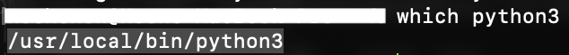
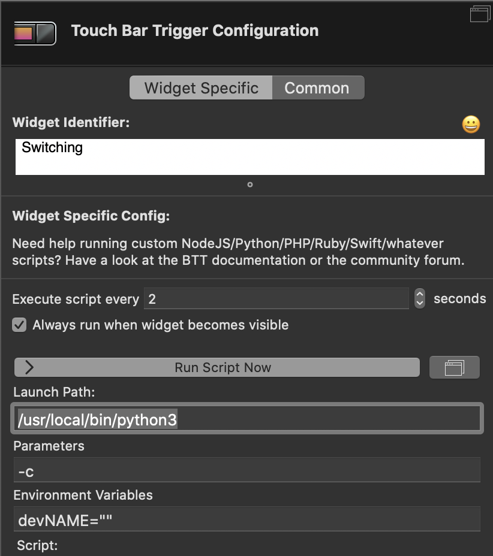
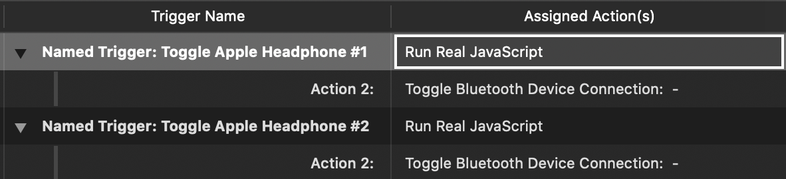
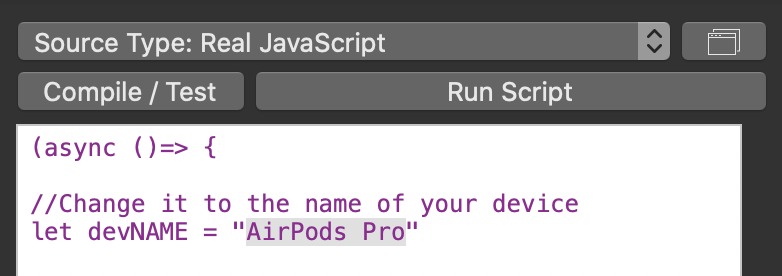
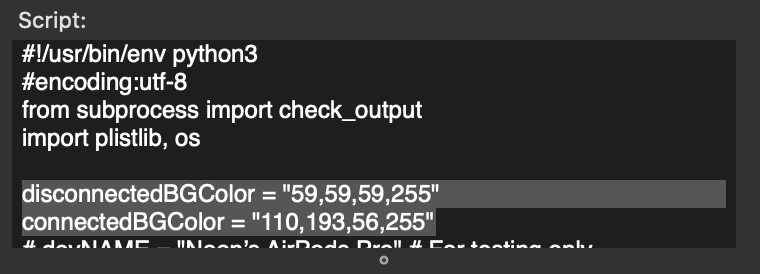

# BTT_AppleWirelessHeadphone
This BetterTouchTool(BTT) preset shows the icon and battery info of your Apple wireless headphones on the touch bar, it will support **ALL** apple headphones and furture modes, such as AirPods (Pro), BestsX, etc, as long as your macOS is up to date.
## Functionality
You can use this preset to toggle up to 2 headphones.

**v1.0:**
+ ***Tap*** to toggle headphone #1
+ ***Long press*** to toggle headphone #2

**v1.1:**
+ ***Tap*** to [toggle or switch](https://github.com/noonchen/BTAudioSwitch#readme) to headphone #1
+ ***Long press*** to [toggle or switch](https://github.com/noonchen/BTAudioSwitch#readme) to headphone #2

| Model | Off | On | On (one pod in case) |
|:----:|:----:|:----:|:----:|
| AirPods Pro ||||
| BeatsX ||| - |

## Setup
*Ensure that your headphone(s) appears on the Bluetooth panel of System Preferences.*

1. Download and double click `AppleHeadphone.bttpreset` to import it into BTT
2. Go to **Touch Bar** section (⌘+1), click on the `shell script/Tasks` widget and change `Launch Path` to the output of `which python3` in Terminal.

3. Go to **Named & Other Trigger** section (⌘+9), find and expand the following triggers, Toggle...#1 is activated by tapping, and Toggle...#2 is by long pressing.

Click on `Run Real JavaScript` and replace the selected string with the name of your device.

Then click on Action 2 and choose your device accordingly.

## Possible Questions
---
Q: The widget flashes every time I tap/press.

A: I cannot control this behavior because BTT will re-render the button if its configuration is changed, and this is why I rename the widget to "switching"...

---
Q: I don't need to switching between multiple devices.

A: That's simple, type/paste the name of your device in `Environment Variables` in the configuration, such as `devNAME="TypeTheNameInHere"`, then change the assigned action to `Toggle Bluetooth Device Connection`, that's all.

---
Q: How to change background color of this widget?

A:

---
Q: How does the python script do it?

A: python calls osascript to get mac address of your headphone, then the productID and battery info can be read from bluetooth.plist, based on the productID we can retrieve the image of your headphone by plists in IOBluetoothUI resources folder.

Apple will update product info along with macOS update, that's why it should work for all Apple headphones.

---
Q: No icon on touch bar

A: It may happens to the older macOS/OS X, in which there are no images of latest apple headphones, in this case, there's no other way but to create a resource folder to include plist and all the images manually.

